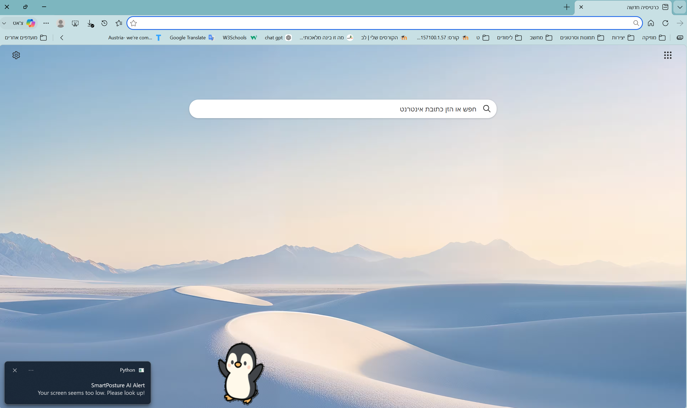
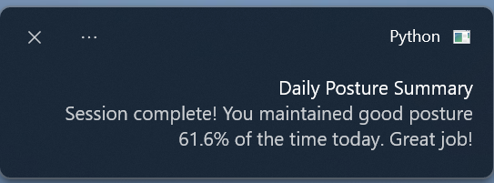

# 🧠 SmartPosture AI — מערכת ניטור יציבה חכמה

מערכת בינה מלאכותית שרצה ברקע ומנטרת את יציבת הישיבה שלך בזמן אמת באמצעות המצלמה, מתריעה על ישיבה שגויה, ומציגה חיית מחמד וירטואלית (פינגווין) כשצריך לתקן.

---

## ✨ פונקציונליות

- **זיהוי יציבה בזמן אמת** — ניתוח תמונה מהמצלמה באמצעות מודל AI כבד
- **3 מדדי יציבה**:
  - 🦴 **Tech Neck** — ראש בולט קדימה ביחס לכתפיים
  - 👀 **מבט למטה** — זווית ראש נמוכה מדי (מסך נמוך)
  - ↔️ **כתפיים לא מאוזנות** — נטייה לצד אחד
- **כיול אישי** — כל משתמש מכייל את קו הבסיס שלו עצמו
- **פרופילים אישיים** — נתוני הכיול נשמרים בקובץ JSON ונטענים בכניסה הבאה
- **פינגווין צף** — חיית מחמד וירטואלית שמופיעה ומסתובבת על המסך כשהיציבה שגויה
- **התרעות מערכת הפעלה** — הודעות Windows בפינת המסך
- **צפצופים** — אזהרה קולית לאחר 10 שניות של ישיבה שגויה
- **סטטיסטיקה יומית** — אחוז הזמן עם יציבה תקינה, מוצג בסיום הסשן
- **קיצורי מקלדת גלובליים** — עובדים גם כשהתוכנה ממוזערת

---

## ⌨️ קיצורי מקלדת

| קיצור | פעולה |
|---|---|
| `Ctrl + Alt + C` | כיול יציבה (לחץ 5 פעמים בישיבה נכונה) |
| `Ctrl + Alt + R` | איפוס פרופיל וכיול מחדש |
| `Ctrl + Alt + =` | הקל על הסובלנות (פחות קפדני) |
| `Ctrl + Alt + -` | הקשח את הסובלנות (יותר קפדני) |
| `Ctrl + Alt + Q` | יציאה + הצגת סיכום יומי |

---

## 🗂️ מבנה הפרויקט

```
SmartPosture/
├── main.py                      — קובץ ראשי, לולאת הוידאו וניהול ההתרעות
├── posture_math.py              — חישובים גיאומטריים (זוויות, מרחקים)
├── profile_manager.py           — ניהול פרופילי משתמשים (שמירה וטעינה מ-JSON)
├── pose_landmarker_heavy.task   — מודל ה-AI של MediaPipe (לא נכלל ב-Git)
├── penguin.png                  — תמונת הפינגווין הצף
└── profiles/                    — תיקיית פרופילי המשתמשים (נוצרת אוטומטית)
```

---

## 🛠️ טכנולוגיות

| ספרייה | שימוש |
|---|---|
| `opencv-python` | קריאת וידאו מהמצלמה ועיבוד תמונה |
| `mediapipe` | זיהוי שלד הגוף ונקודות ציון (AI) |
| `tkinter` + `Pillow` | חלון הפינגווין הצף והשקוף |
| `plyer` | הודעות Windows (Toast Notifications) |
| `keyboard` | קיצורי מקלדת גלובליים ברקע |
| `winsound` | צפצופי אזהרה |
| `threading` | הרצת פעולות במקביל ללא תקיעת התוכנית |

---

## 🚀 התקנה והרצה

### דרישות מקדימות
- Python 3.9 ומעלה
- Windows (בגלל `winsound` ו-`plyer`)
- מצלמת רשת

### התקנת תלויות

```bash
python -m venv venv
venv\Scripts\activate
pip install -r requirements_light.txt
pip install -r requirements_heavy.txt
python main_light.py
python main.py
```

### הורדת מודל ה-AI

הורידי את קובץ המודל מאתר MediaPipe:
```
pose_landmarker_heavy.task
```
ושימי אותו באותה תיקייה עם `main.py`.

### הרצה

```bash
python main.py
```

---

## 🎮 הוראות שימוש ראשוני

```
1. הריצי את התוכנה
2. הכניסי את שמך
3. שבי ישר מול המצלמה
4. לחצי Ctrl+Alt+C בדיוק 5 פעמים לכיול
5. התוכנה תרוץ ברקע ותתריע בעת הצורך
```

> הכיול נשמר אוטומטית — בפעם הבאה שתיכנסי עם אותו שם, הפרופיל ייטען מיד.

---

## ⚙️ פרמטרים לכוונון (בתוך `main.py`)

```python
POSTURE_TOLERANCE = 8.0      # חריגה מותרת לצוואר (מעלות)
PITCH_TOLERANCE = 12.0       # חריגה מותרת לזווית ראש
ASYMMETRY_THRESHOLD = 7.0    # חריגה מותרת לנטיית כתפיים
BAD_POSTURE_TIME_LIMIT = 10.0 # שניות לפני התרעה
```

---

## 📸 צילומי מסך

### פינגווין בפעולה (יציבה שגויה)


### סיכום יומי
 

